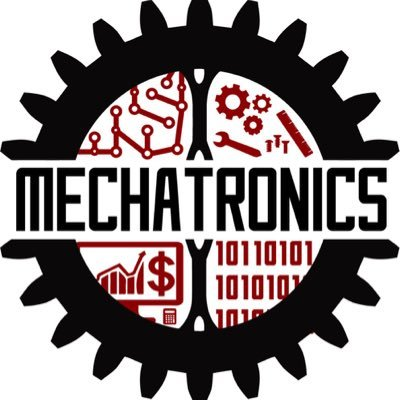
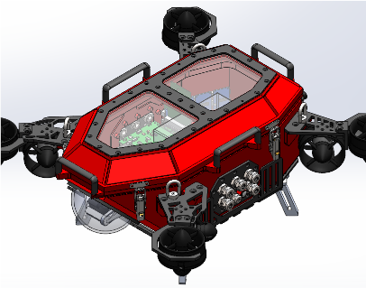

# SDSU Mechatronics 2022

#### This Repository is under construction.

# About this repo

This repository has mandatory code styling and commit rules.

- ONLY upload source code. Do NOT commit binaries or Docker containers to this repository.

Pull request to master requirements:
Approved PR in `yourfeaturename-beta` branch from ANY project manager or software lead is *REQUIRED*. 

All code should be pushed to a `yourfeaturename-beta` branch where a PR is then submitted, along with linking relevant issues here on GitHub. ***If you do NOT name your branch with the*** `-beta` ***naming convention, it is assumed the code is not ready to be merged and as a result will not be merged***.

[Python installation and setup guide](src/man/python_setup_guide.md)

Python styling guide: All code in Python must follow [our styling guide](src/man/git_guide.md).

C/C++ styling guide: All C/C++ code must follow the [Linux Kernal styling guide](https://www.kernel.org/doc/html/v4.10/process/coding-style.html).

Git naming conventions and usage: To make your own branches and push to this repository, read [our Git Guide](src/man/git_guide.md).

# About Scion

### Scion is the SDSU Mechatronics robot for the 2022 RoboSub Competition.

